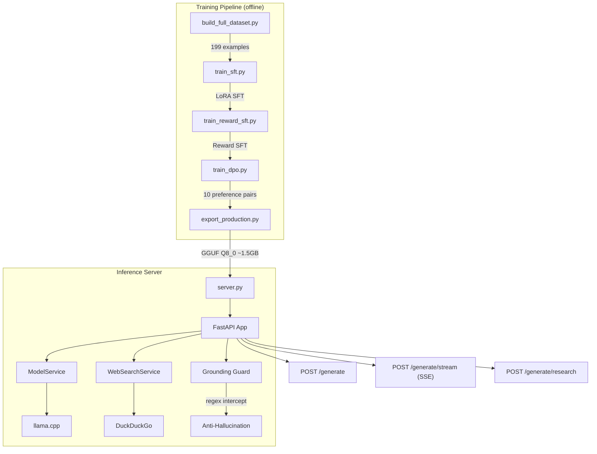

I wanted to understand what it actually takes to make a language model good at writing code — not the theory, the execution. So I picked a base model, gathered training data, fine-tuned it, and built a production server around it.

The result is BlitzKode: a local, API-first coding assistant that runs entirely offline. 500+ downloads on Hugging Face.

## Architecture

<div class="diagram">
<div class="diagram-title">System Architecture</div>

</div>

## How it works

### The training pipeline

I built a 4-stage training pipeline. Each stage adds a different signal:

1. **SFT** — Fine-tune LoRA adapters on 71 curated coding problems (algorithms, data structures, Python patterns)
2. **Reward-SFT** — Continue training with heuristic reward signals for correctness and code quality
3. **DPO** — Direct Preference Optimization on 10 handcrafted chosen/rejected pairs (teaching the model to prefer optimal solutions with explanations over brute-force solutions)
4. **Export** — Merge LoRA, convert to GGUF Q8_0 quantization for efficient CPU inference

The dataset combines 71 custom algorithmic problems, 100 MetaMathQA samples, and 28 practical coding patterns — 199 examples total.

### The anti-hallucination guard

Small models (1.5B parameters) reliably hallucinate plausible-looking but fake API signatures. Instead of trying to fix this at the model level, I added a lightweight regex guardrail in the server that intercepts suspicious queries *before* they reach the model.

<div class="code-callout">
<div class="code-label">server.py — Grounding Guard</div>

```python
_SIGNATURE_QUERY_RE = re.compile(
    r"(?:signature|how\s+(?:do|can)\s+i\s+use|usage\s+of).{0,120}?"
    r"(?P<symbol>[A-Za-z_][\w.]*\s*\([^)]*\)|[A-Za-z_][\w.]*\s+function)",
    re.IGNORECASE | re.DOTALL,
)

def _grounding_guard_response(prompt: str, has_external_context: bool = False) -> str | None:
    if has_external_context or _CODE_CONTEXT_RE.search(prompt):
        return None
    match = _SIGNATURE_QUERY_RE.search(prompt)
    if not match:
        return None
    symbol = " ".join(match.group("symbol").split())
    return (
        f"I don't have enough verified context to know the signature or usage of `{symbol}`. "
        "Please provide the source code or documentation, or enable research mode."
    )
```
</div>

This is the cleverest piece of engineering in the project. The guard smartly exempts prompts that contain code blocks (meaning the user pasted source code) or research context. It costs zero inference time and catches the most common failure mode of small models.

### The streaming SSE bridge

llama.cpp's Python bindings are synchronous and blocking. The server needs async FastAPI with SSE streaming. The solution is a clean thread-to-asyncio bridge:

<div class="code-callout">
<div class="code-label">server.py — Thread-to-Async SSE Bridge</div>

```python
async def _locked_stream():
    async with model_lock:
        loop = asyncio.get_running_loop()
        token_q: asyncio.Queue[str | None] = asyncio.Queue()

        def emit(chunk: str | None) -> None:
            loop.call_soon_threadsafe(token_q.put_nowait, chunk)

        thread = threading.Thread(
            target=model_service._run_stream,
            args=(sanitized, emit),
            daemon=True,
        )
        thread.start()
        while True:
            chunk = await token_q.get()
            if chunk is None:
                break
            yield chunk
```
</div>

The blocking LLM runs in a daemon thread, pushing token strings into a thread-safe `asyncio.Queue` via `loop.call_soon_threadsafe`. The async generator drains the queue and yields SSE frames. A single `asyncio.Lock` serializes all model access to prevent concurrent inference crashes.

## Metrics

<div class="metrics">
    <div class="metric"><span class="metric-value">1.5B</span><span class="metric-label">Parameters</span></div>
    <div class="metric"><span class="metric-value">1.5 GB</span><span class="metric-label">Model Size</span></div>
    <div class="metric"><span class="metric-value">500+</span><span class="metric-label">Downloads</span></div>
    <div class="metric"><span class="metric-value">75%</span><span class="metric-label">Pass Rate</span></div>
    <div class="metric"><span class="metric-value">199</span><span class="metric-label">Training Examples</span></div>
</div>

Evaluation on 4 test cases (CPU, n_ctx=2048): Python factorial (5.4s), binary search (17.7s), SQL query (3.8s), and uncertainty detection (2.0s). 3/4 pass at raw model level, 4/4 pass with the API guardrail.

## Impact

<div class="impact">
<div class="impact-title">Why this matters</div>

**Anti-hallucination engineering for small models.** The grounding guard is an elegant, zero-cost solution to a real problem. Instead of training the model to say "I don't know" (which small models are bad at), the server refuses to even let the question reach the model.

**Full reproducibility.** The repo contains everything: dataset generation, all 4 training stages, evaluation harness, GGUF export, Docker deployment, and HuggingFace publishing scripts. A developer can clone and rebuild the entire model from scratch.

**Production-grade local serving.** Per-IP rate limiting, bearer token auth, CORS, optional GPU offload, SSE streaming, DuckDuckGo search with HTML fallback, and comprehensive health endpoints — all in a single 881-line file.

**Tiny footprint, real utility.** At 1.5 GB, the model runs on 4 GB RAM, starts in 0.35 seconds, and generates correct code for common algorithmic tasks 75% of the time. For developers who want an offline coding assistant that never phones home, this is a viable solution.
</div>

The code is on [GitHub](https://github.com/neuralbroker/blitzkode) and the model is on [Hugging Face](https://huggingface.co/neuralbroker/blitzkode).
