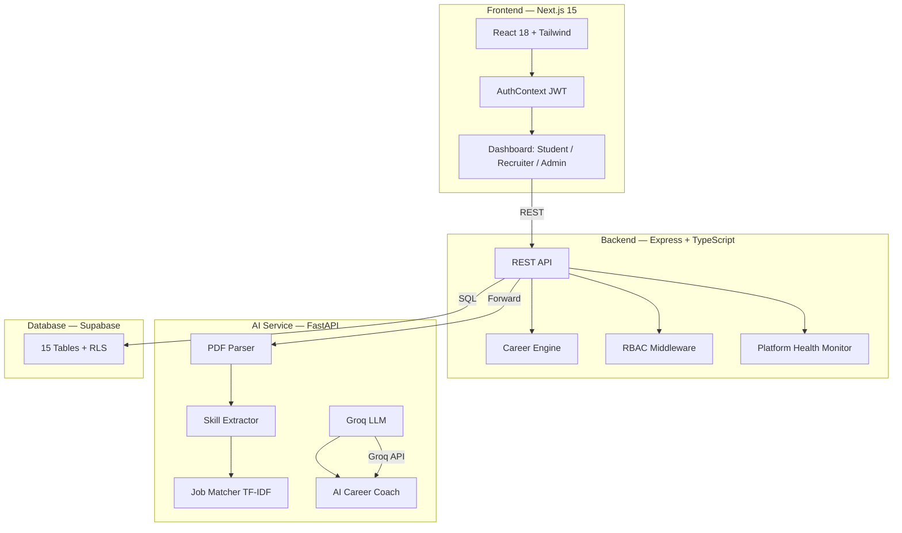

EsenceLab started as a hackathon project and grew into something bigger. It's a full-stack AI-assisted hiring and career intelligence platform that connects students, recruiters, and admins.

I led a team of 4 to build it. We won 2nd Prize at Innovision.

## Architecture

<div class="diagram">
<div class="diagram-title">Three-Service Architecture</div>

</div>

## How it works

### Resume upload to career recommendations

The flow is: upload PDF → extract text → parse skills → score resume → generate roadmap → AI coach.

<div class="code-callout">
<div class="code-label">careerEngine.ts — Resume Strength Scoring</div>

```typescript
const overallScore = clampPercent(
    skillsCompleteness * 0.4 +
    experienceRelevance * 0.25 +
    projectStrength * 0.2 +
    formattingConsistency * 0.15
);
```
</div>

The scoring algorithm weighs four dimensions against 7 defined career roles (Backend Dev, Frontend Dev, Full Stack, Data Analyst, Embedded Systems, ECE, EEE). It generates personalized improvement suggestions based on which dimension scored lowest.

### Three-role architecture with full RBAC

Students get career roadmaps, learning plans, mock interviews, and AI coaching. Recruiters (gated behind admin approval) post jobs and get AI-ranked candidate matches. Admins see a real-time health dashboard with P50/P95/P99 latency percentiles, error rates, and threshold-based alerting.

### Defense-in-depth reliability

Every external call — AI service, Groq API, Supabase — has timeouts, retries with exponential backoff, abort controllers, and graceful local fallbacks. The AI service returns structured guidance even when Groq is unavailable. The backend falls back to local TF-IDF matching when the AI service is down.

## Metrics

<div class="metrics">
    <div class="metric"><span class="metric-value">3</span><span class="metric-label">Services</span></div>
    <div class="metric"><span class="metric-value">15</span><span class="metric-label">DB Tables</span></div>
    <div class="metric"><span class="metric-value">7</span><span class="metric-label">Career Roles</span></div>
    <div class="metric"><span class="metric-value">2nd</span><span class="metric-label">Prize Innovision</span></div>
</div>

## Impact

<div class="impact">
<div class="impact-title">Why this matters</div>

**AI-powered career intelligence, not just job listing.** The platform provides resume strength scoring with section-level breakdown, skill-gap analysis against 7 career roles, personalized 30/60-day learning plans, mock interview question packs, and an LLM-powered career coach with 5 feature modes.

**India-specific career context.** The platform includes roles for Indian engineering students (ECE, EEE tracks), references SWAYAM/NPTEL courses, and provides beginner onboarding for students who haven't yet chosen a specialization.

**Production-grade operational tooling.** Platform health monitoring with latency percentiles, per-endpoint metrics, and configurable alerts — unusual for a hackathon project, but exactly the kind of thing that makes a system production-ready.
</div>

The code is on [GitHub](https://github.com/neuralbroker/esencelab).
