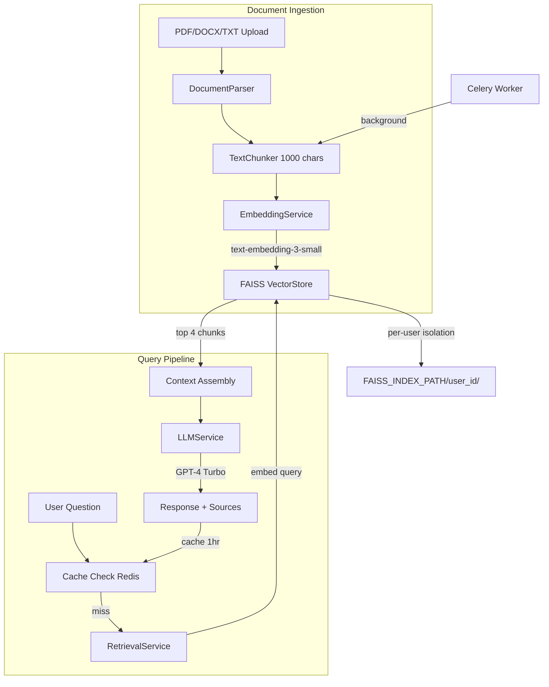

I've read a lot of long PDFs — research papers, technical reports, documentation — and I've gotten tired of manually searching through them. Ctrl+F only gets you so far when you don't know the exact phrase you're looking for.

So I built Lexora AI. Upload a document, ask a question in plain English, get an answer with citations showing exactly where the answer came from.

## Architecture

<div class="diagram">
<div class="diagram-title">RAG Pipeline Architecture</div>

</div>

## How it works

### Document ingestion pipeline

The pipeline is clean: parse → chunk → embed → store.

<div class="code-callout">
<div class="code-label">document_service.py — Core Ingestion</div>

```python
async def _process_document(self, document: Document) -> None:
    text = await DocumentParser.parse_async(document.file_path, document.file_type)
    chunks = self.chunker.chunk_text(text)
    vectors = self.embedding_service.embed_documents(chunks)
    vector_store = get_vector_store(self.user.id)
    vector_ids = vector_store.add_vectors(
        vectors=vectors,
        documents=chunks,
        document_ids=[document.id] * len(chunks),
    )
    document.chunk_count = len(chunks)
    document.vector_ids = vector_ids
```
</div>

Documents are chunked using recursive splitting with 8 separator levels (paragraphs down to characters). Default: 1000 characters with 200-character overlap.

### The smart vector store design

FAISS doesn't support efficient deletion. Lexora solves this by storing raw embedding vectors alongside metadata in a JSON file. When a document is deleted, the entire index is rebuilt from stored embeddings — avoiding expensive re-embedding API calls.

<div class="code-callout">
<div class="code-label">vector_service.py — Embedding-Preserving Rebuild</div>

```python
def _rebuild_index(self):
    vectors = [m.get("embedding") for m in self.metadata]
    if any(vector is None for vector in vectors):
        embedding_service = get_embedding_service()
        vectors = embedding_service.embed_documents(texts)
    self.index = faiss.IndexFlatL2(self.dimension)
    self.index.add(np.array(vectors, dtype=np.float32))
    self._save()
```
</div>

This is a pragmatic engineering tradeoff: store embeddings in metadata JSON so document deletion avoids costly re-embedding API calls. It saves money and time at scale without switching to a more complex vector database.

### Three-layer retrieval

Retrieval goes: Redis cache → FAISS similarity search → context assembly with source attribution.

<div class="code-callout">
<div class="code-label">chat_service.py — Cached RAG Retrieval</div>

```python
async def _retrieve_context(self, query, document_ids=None):
    cache_key = f"retrieval:{self.user.id}:{hashlib.sha256(query.encode()).hexdigest()[:16]}:{doc_filter}"
    cached = await cache_service.get(cache_key)
    if cached:
        return cached["context"], cached["sources"]

    retrieval_service = get_retrieval_service(self.user.id)
    context, sources = retrieval_service.get_context(query, k=4, document_ids=document_ids)
    await cache_service.set(cache_key, {"context": context, "sources": sources}, expire=3600)
    return context, sources
```
</div>

The cache key includes user ID, query hash, and document filter to prevent cross-tenant data leakage.

## Metrics

<div class="metrics">
    <div class="metric"><span class="metric-value">1536d</span><span class="metric-label">Embeddings</span></div>
    <div class="metric"><span class="metric-value">4</span><span class="metric-label">Chunk Retrieval</span></div>
    <div class="metric"><span class="metric-value">1hr</span><span class="metric-label">Cache TTL</span></div>
    <div class="metric"><span class="metric-value">31</span><span class="metric-label">Tests Passing</span></div>
</div>

## Impact

<div class="impact">
<div class="impact-title">Why this matters</div>

**Production-ready RAG, not a toy demo.** Multi-user isolation with per-user FAISS indexes, token revocation via Redis blacklisting, refresh token rotation, structured JSON logging, and Prometheus metrics.

**Smart vector store design.** The embedding-preserving rebuild strategy avoids costly re-embedding API calls when documents are deleted — a pragmatic insight that saves money at scale.

**Dual-mode document processing.** A toggle switches between inline processing (dev-friendly) and Celery background jobs (production). Same codebase, different deployment modes.

**Deployment-ready.** Full Docker Compose stack (Postgres + Redis + App + Celery + Nginx), Terraform configs for AWS ECS/Fargate and GCP Cloud Run, and monitoring guidelines with specific alert thresholds.
</div>

The code is on [GitHub](https://github.com/neuralbroker/lexora-ai).
