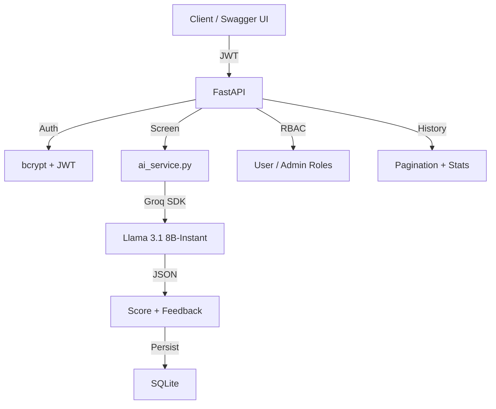

Most resume screening tools are either rule-based keyword matchers or expensive enterprise SaaS products. I wanted to see if a free LLM API could do better.

So I built AI Resume Screener: a FastAPI REST API that uses Groq's free tier with Llama 3.1-8B-Instant to analyze resume-job fit. Paste a resume, paste a job description, get a score.

## Architecture

<div class="diagram">
<div class="diagram-title">System Architecture</div>

</div>

## How it works

### The AI screening engine

The core is surprisingly simple — 60 lines of Python that orchestrate input validation, LLM prompting, response parsing, and defensive fallbacks.

<div class="code-callout">
<div class="code-label">ai_service.py — LLM Screening</div>

```python
def screen_resume(job_description: str, resume_text: str) -> dict:
    response = client.chat.completions.create(
        model="llama-3.1-8b-instant",
        messages=[{
            "role": "user",
            "content": f"""
Analyze this resume against the job description.
Job Description: {job_description}
Resume: {resume_text}
Respond ONLY in valid JSON:
{{"score": <0-100>, "match_level": "<Strong|Moderate|Weak>", "feedback": "<3-4 sentences>"}}
"""
        }],
        temperature=0.3,
        max_tokens=500,
    )
    raw = response.choices[0].message.content.strip()
    raw = raw.replace("```json", "").replace("```", "").strip()
    result = json.loads(raw)

    # Server-side score clamping
    score = max(0.0, min(100.0, float(result["score"])))
    if score >= 75: result["match_level"] = "Strong"
    elif score >= 50: result["match_level"] = "Moderate"
    else: result["match_level"] = "Weak"
    return result
```
</div>

Key design decisions: `temperature=0.3` for deterministic scoring. Markdown fence stripping before JSON parse. Server-side score clamping that overrides the LLM's `match_level` — the system never trusts the LLM's output blindly.

### JWT auth with compositional RBAC

The auth layer uses a clean dependency chain: `get_current_user` validates the JWT and loads the user. `get_current_admin` composes on top — first authenticate, then check role.

<div class="code-callout">
<div class="code-label">auth.py — Compositional Role Checking</div>

```python
def get_current_user(token: str = Depends(oauth2_scheme), db: Session = Depends(get_db)) -> User:
    payload = jwt.decode(token, SECRET_KEY, algorithms=[ALGORITHM])
    username = payload.get("sub")
    user = db.query(User).filter(User.username == username).first()
    return user

def get_current_admin(current_user: User = Depends(get_current_user)) -> User:
    if current_user.role != "admin":
        raise HTTPException(status_code=403, detail="Admin access required")
    return current_user
```
</div>

Any endpoint that needs auth adds `Depends(get_current_user)`. Admin endpoints add `Depends(get_current_admin)`. Zero duplication.

### Resource-level authorization

Users can only see their own screenings unless they're admins. This is enforced at the endpoint level, not just the route level.

<div class="code-callout">
<div class="code-label">screen.py — Ownership Check</div>

```python
@router.get("/{screening_id}")
def get_screening(screening_id: int, ...):
    screening = db.query(Screening).filter(Screening.id == screening_id).first()
    if screening.user_id != current_user.id and current_user.role != "admin":
        raise HTTPException(status_code=403, detail="Not authorized")
    return screening
```
</div>

## Metrics

<div class="metrics">
    <div class="metric"><span class="metric-value">446</span><span class="metric-label">Lines of Python</span></div>
    <div class="metric"><span class="metric-value">$0</span><span class="metric-label">API Cost</span></div>
    <div class="metric"><span class="metric-value">8</span><span class="metric-label">Dependencies</span></div>
    <div class="metric"><span class="metric-value">&lt;1s</span><span class="metric-label">Response Time</span></div>
</div>

## Impact

<div class="impact">
<div class="impact-title">Why this matters</div>

**Zero-cost AI inference.** Groq's free tier with Llama 3.1-8B-Instant provides AI-powered resume screening at no API cost. Groq's hardware-accelerated LPU means sub-second response times.

**Resilient LLM integration.** Three-layer defense: input validation, JSON fence stripping, and fallback response on parse failure. Server-side score clamping means the system never trusts the LLM's output blindly — it always enforces its own business rules.

**Production patterns in 446 lines.** Dependency injection for auth, compositional role checking, resource-level authorization, input validation at the Pydantic layer, proper HTTP status codes, and error classification (400 vs 503).

**Fully self-contained.** SQLite means zero infrastructure setup. One command starts everything — database auto-creates on first run.
</div>

The code is on [GitHub](https://github.com/neuralbroker/ai-resume-screener).
